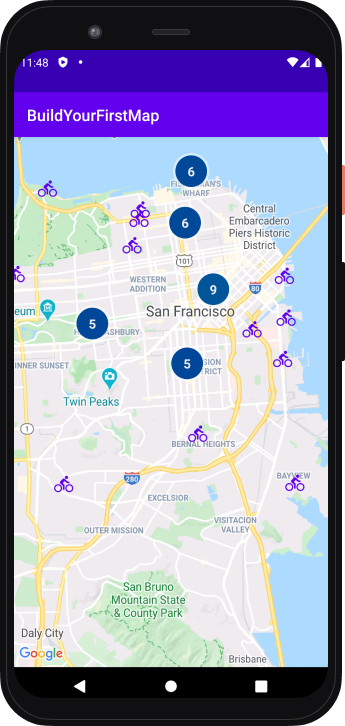

Google Maps Platform 101: Android Codelab
=========================================

## Description
Accompanying starter and solution code for the [Google Maps Platform 101: Android Codelab][codelab], a codelab that teaches you how to integrate Maps SDK for Android into your app and use its core features.

## Requirements
* Android Studio 3.6 or higher

[codelab]: https://codelabs.developers.google.com/codelabs/maps-platform-101-android/index.html